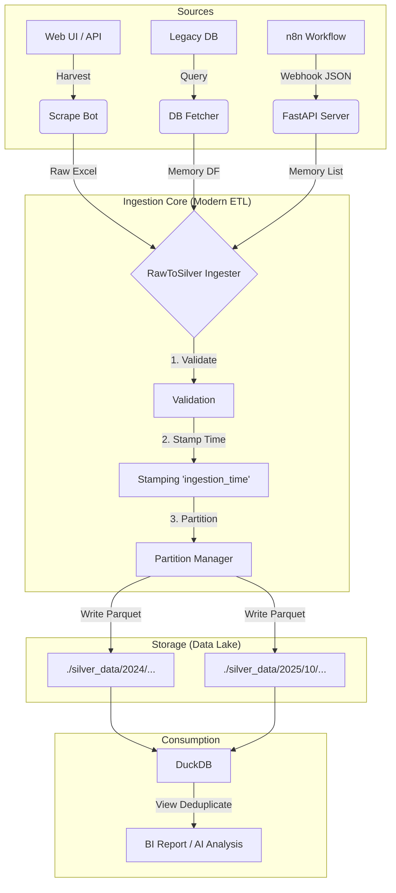

# 🕷️ PPC Scraper & Data Ingestion Tool

A robust ETL tool designed to harvest PPC data, standardize it, and ingest it into a partitioned Data Lakehouse (Silver Layer).

## 🏗️ Architecture Flow



## 🚀 How It Works
1.  **Extract:** Data is pulled from various sources (PPC Tool, DB, or n8n).
2.  **Stamp:** Every record is injected with an `ingestion_time` timestamp. **This is the Source of Truth.**
3.  **Partition:** Data is saved into folders by Year/Month (e.g., `silver_data/2025/10/`).
4.  **No-Merge Policy:** Files are never overwritten. New data is simply appended as a new Parquet file.
5.  **Deduplication:** Occurs at **Read-Time** using DuckDB/Polars (selecting the record with the latest `ingestion_time`).

---

## 🛠️ Usage Guide

### 1. Standalone Python Script (Manual Run)
Use this for backfilling data or testing locally.

**Command:**
```bash
# Run inside scrape_tool directory
uv run python scrape_bot.py --start 2025-10-01 --end 2025-10-31 --step day
```

**Options:**
*   `--start`, `--end`: Date range (YYYY-MM-DD).
*   `--step`: Granularity (`day`, `month`, `year`, `total`). Recommended: `day`.
*   `--dry-run`: Simulate process without calling real APIs.
*   `--debug`: Show verbose logs.

### 2. API Server (For n8n / Scheduling)
Use this to integrate with n8n or trigger jobs remotely.

**Start Server:**
```bash
uv run uvicorn api_server:app --host 0.0.0.0 --port 8000
```

**Endpoint 1: Trigger Scrape Job**
*   **Method:** `POST`
*   **URL:** `http://localhost:8000/trigger/scrape`
*   **Body:**
    ```json
    {
      "start_date": "2025-11-01",
      "end_date": "2025-11-01",
      "step": "day"
    }
    ```
*   **Behavior:** Starts the `PPCHarvester` in a background thread. Returns immediately.

**Endpoint 2: Direct Ingestion (Future/TODO)**
*   **Method:** `POST`
*   **URL:** `http://localhost:8000/ingest/memory`
*   **Body:** JSON Payload from n8n.
*   **Behavior:** Directly saves data to Silver Layer without scraping.

---

## 🤖 Integration with n8n

### Scenario A: Daily Scheduler (Recommended)
1.  **n8n Node:** `Cron` (Runs every day at 02:00 AM).
2.  **n8n Node:** `HTTP Request`.
    *   **Method:** POST.
    *   **URL:** `http://<YOUR_VPS_IP>:8000/trigger/scrape`
    *   **Body:**
        ```json
        {
          "start_date": "{{ $today.minus(1).format('yyyy-MM-dd') }}",
          "end_date": "{{ $today.minus(1).format('yyyy-MM-dd') }}",
          "step": "day"
        }
        ```
3.  **Result:** Python bot wakes up, scrapes yesterday's data, and saves it.

### Scenario B: Data Pushing (Advanced)
If n8n fetches data from another source (e.g., Google Sheets, Email Attachment):
1.  **n8n Node:** Read Data -> Convert to JSON.
2.  **n8n Node:** HTTP Request -> POST `/ingest/memory` (To be implemented).
